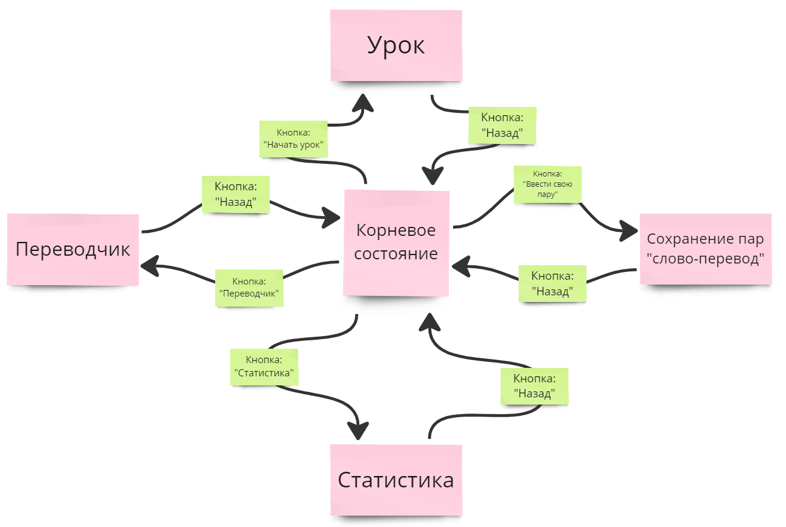

# Software Requirements Specification

## Learning Language Bot

### 1. Введение

#### 1.1 Описание проекта и его цели

В современном мире множество информации предоставляется на самых разных языках. 
Изучение и понимание некоторых из них облегчает работу с большим количеством ресурсов.
Таким образом цель проекта состоит в создании бота в Telegram,
который мог бы предоставлять доступ к изучению лексики английского 
(как довольно популярного) языка.

#### 1.2 Определение области применения

Бот будет доступен через Telegram и предназначен для пользователей,
желающих улучшить свой словарный запас в английском языке. 

### 2. Общее описание

#### 2.1 Продукт

Продукт "language-learning-bot" представляет собой автономного бота,
разработанного для помощи пользователям в изучении английского языка.
Бот функционирует как самостоятельное приложение в мессенджере
и предоставляет функциональность изучения новых слов на английском языке
и проверки знаний пользователей.

#### 2.2 Функции продукта

Основные функции продукта включают:

- Осуществление перевода заданных пользователем слов.
- Сохранение слов или словосочетаний, которые хотелось бы изучить в дальнейшем.
- Режим изучения с возможностью настройки сложности.
- Отправка уведомлений о невыполненных заданиях.
- Сбор статистики изученных слов с разбивкой по сложности.

#### 2.3 Область применения

Продукт предназначен для обучающихся пользователей: людей, желающих улучшить свой словарный запас
на английском языке. Пользователи могут иметь разные уровни знаний английского.

#### 2.4 Среда выполнения

Продукт будет функционировать в Telegram. Бот будет работать на Python.

#### 2.5 Дизайн и реализация

Продукт будет реализован с использованием языка программирования Python
и библиотек для Telegram. Он будет взаимодействовать с пользователями
через текстовые сообщения и функциональные кнопки.  
Бот предоставляет возможность нахождения в пяти главных состояниях:  
- Корневое состояние с возможностью переключиться на остальные.
- Сохранение слов для дальнейшего изучения.
- Перевод заданных пользователем слов с возможностью их сохранения для изучения.
- Обучение с выбранной в текущий урок сложностью. Урок составлен из сохраненных пользователем слов 
или с помощью генерации слов, реализованной в приложении.
- Статистика слов, которая содержит в себе недавние показатели и недавние изученные слова.  
  
Модель, которая показывает переходы между этими состояниями находится в приложении B.
Дальнейшая реализация подсостояний данных главных пяти состояний предполагается в соответствии с
описанием каждой их них.

#### 2.6 Пользовательская документация

Пользовательская документация будет предоставлена в виде руководства пользователя, объясняющего, как
начать использовать бота, как проходить задания и как интерпретировать статистику.

#### 2.7 Предположения и зависимости

Проект строится на следующих предположениях и зависимостях:
- Пользователи будут иметь доступ к мессенджерам, через которые будут взаимодействовать с ботом.
- Серверное окружение для бота будет надежным и доступным 24/7.
- База данных будет использоваться для хранения данных о пользователях и статистике.
- Ресурсы для обеспечения безопасности данных будут предоставлены соответствующим образом.

### 3. Системные функции

#### 3.1 Осуществление перевода заданных пользователем слов.

Эта функция дает возможность пользователю быстро перевести слово или словосочетание.

- стимул: в состоянии переводчика вводится слово
- ответ: бот отправляет введенное слово с его переводом

### 3.2 Сохранение слов или словосочетаний, которые хотелось бы изучить в дальнейшем.

Сохранение слов с предложенным автоматически переводом или своим альтернативным переводом.

- стимул: кнопка сохранения из состояния переводчика или введение по шаблону слова и
его перевода в состоянии сохранения слов
- ответ: программа сохраняет в базу пользователя полученную пару

### 3.3 Уведомление о невыполненных заданиях

Если пользователь не выполняет задания, то бот отправляет уведомление о том что задание не
выполнено.

- стимул: окончание дня без завершения задания
- ответ: бот отправляет уведомление с напоминаем о невыполненном задании

### 3.4 Сбор статистки изученных слов

Бот собирает статистику о словах, изученных пользователем.  
Статистика включает в себя статистику прохождения текущего задания,
количество изученных слов, статистику за неделю.

- стимул: пользователь запрашивает статистику по категории или заканчивает урок
- ответ: бот отправляет статистику по выбранной категории

### 3.5 Урок по изучению слов

Бот предлагает выбрать сложность предстоящего урока. Далее по выбранной сложности
подбирается количество пар слов, которые в последствии по очереди подсвечиваются пользователю
в выбранном языке. По исходу всех слов показываются верные ответы и количество набранных баллов за урок.
Неправильные ответы отправляются на следующие уроки.

- стимул: пользователь переход в режим изучения и начинает урок
- ответ: проведение урока с заданной сложностью

### 3.6 Функциональные требования

- Бот должен иметь доступ к английским словам и их переводам
- Бот должен иметь возможность генерировать случайные слова и их переводы для отправки пользователю
- Бот должен иметь интерфейс для взаимодействия с пользователем
- Бот должен иметь алгоритм проверки правильности пользовательских ответов
- Бот должен иметь систему уведомлений и напоминаний
- Бот должен иметь доступ к данным пользователя, такие как изученные слова, результаты выполненных
  заданий
- Бот должен генерировать отчеты о статистике слов

## Требования к взаимодействию с внешними системами и интерфейсами

### Пользовательский интерфейс

Интерфейс пользователя должен быть интуитивно понятным.
Пользователи должны иметь возможность легко отправлять ответы на вопросы бота и получать
уведомления.

### Програмный интерфейс

- Бот должен поддерживаться в Telegram
- Бот должен взаимодействовать с базой данных для сохранения пользовательской статистике и слов

### Аппаратный интерфейс

Для обеспечения надежной работы бота требуется серверное оборудование.
Серверы должны обладать необходимыми ресурсами для обработки запросов и
хранения данных.

### Коммуникационный интерфейс

- Бот будет использовать API Telegram для отправки сообщений
- Вся коммуникация между ботом и сервером, а также между ботом и Telegram, должна быть обеспечена
  безопасными протоколами и шифрованием данных

## Нефункциональные требования

### Требования к производительности

- Ответы бота к пользователю должен быть в течение 5 секунд

### Требования к безопасности

Персональные данные о пользователей, включая их ответы и статистику,
должны быть надежно защищены и не доступны для сторонних лиц.

### Атрибуты качества программного обеспечения

- Бот должен быть доступен 24/7 для пользователей, минимизируя периоды недоступности
- Програмное обеспечение должно функционировать без сбоев
- Интерфейс пользователя должен быть интуитивно понятным
- Программа должна быть способной масштабироваться для поддержки роста числа пользователей

### Требования к безопасности

- Программа должен иметь механизм защиты от атак и защиту от SQL-инъекций

## Другие требования

- Бот должен предоставлять документация для пользователей, объясняющую как пользоваться ботом

## Приложение A: Глоссарий

- Telegram - мессенджер
- API - application programming interface. Набор правил и протоколов, который позволяет програмному
  обеспечению взаимодействовать с другим програмным обеспечением или службами
- Настройка сложности урока - количество изучаемых слов, выбранное перед занятием
- Слово - слово/словосочетание
- Пара слов - слово и его перевод

## Приложение B: Модель взаимодействия

## Приложение С: Список проблем

| Номер | Проблема                                                   | Приоритет |
|-------|------------------------------------------------------------|-----------|
| 1     | Реализовать бота                                           | Высокий   |
| 2     | Определить требования к серверному оборудованию и хостингу | Средний   |
| 3     | Подготовить документацию для пользователей                 | Низкий    |

